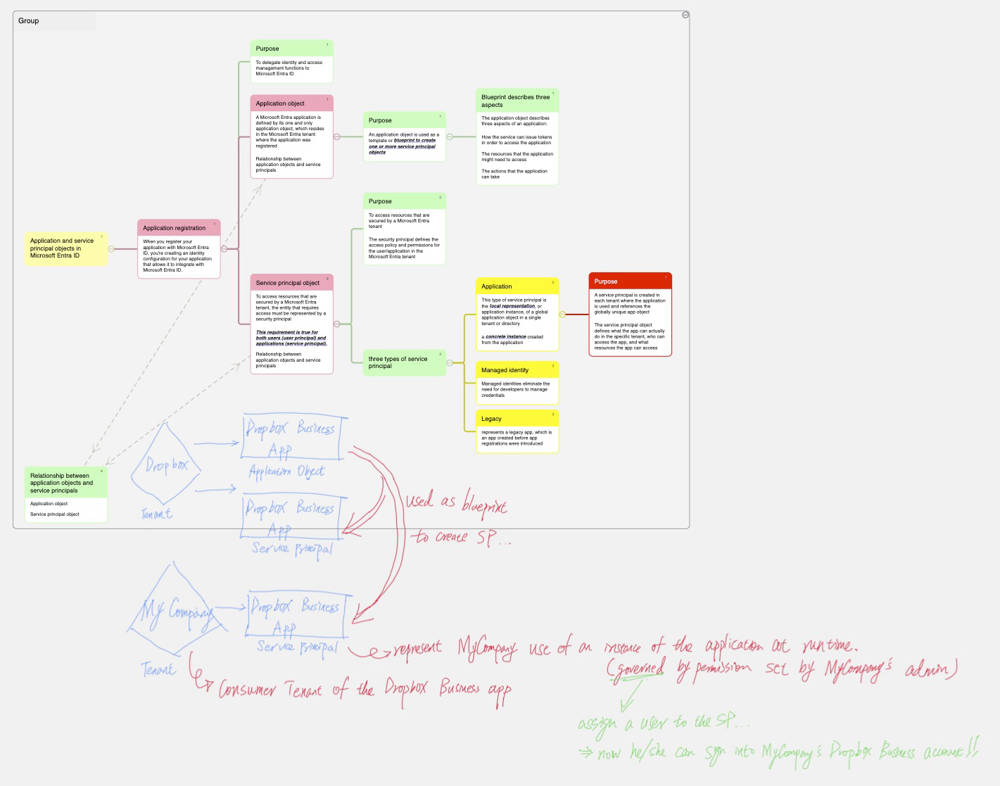

When I first started learning about Entra ID (formerly Azure Active Directory), one thing that really tripped me up was understanding the difference between App Registration and Service Principal. Turns out I wasn't alone—I've seen this same confusion everywhere I've worked.

The thing is: these two concepts are very similar, which is exactly why they're confusing. The main difference comes down to scope. App Registration is globally unique across all of Azure, while Service Principal is only unique within your specific tenant.

Since the differences are pretty subtle, I put together this mind map using [MarginNote 4](https://www.marginnote.com). The informations are mostly extracted from the [Microsoft Doc](https://learn.microsoft.com/en-us/entra/identity-platform/app-objects-and-service-principals). It really helped me finally "get it," so I figured I'd share it in case it helps anyone else who's struggling with the same thing.

**View full diagram**: [PDF](/app-registration-and-service-principal.assets/app-registration-and-service-principal.pdf)

