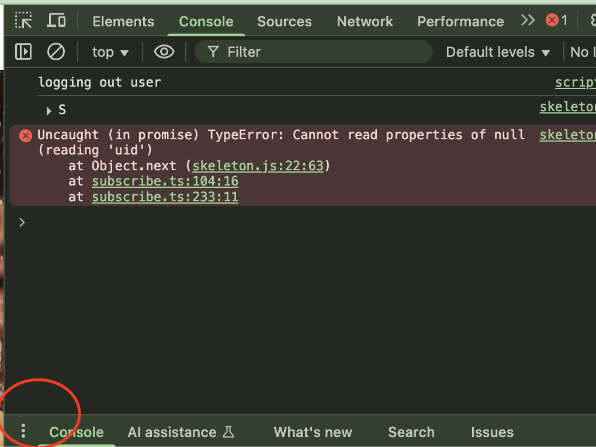
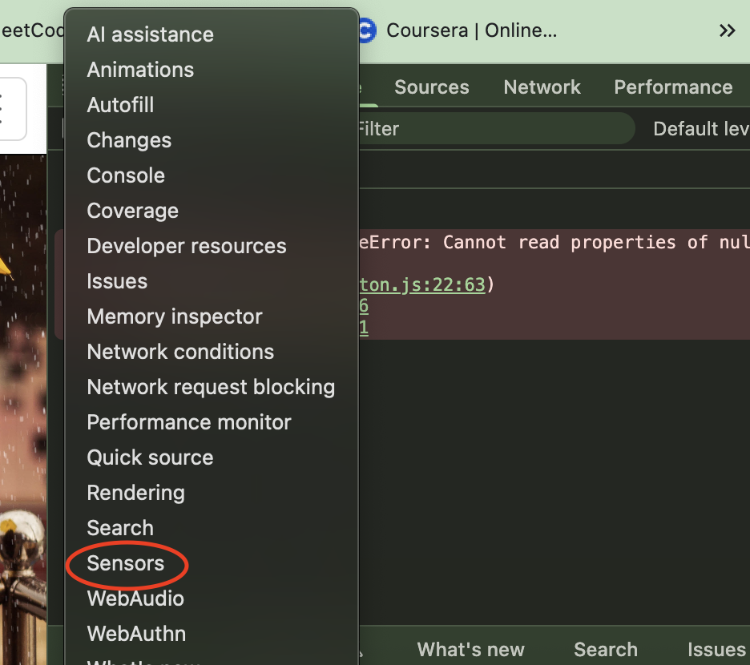

# Rainmate

[Go to demo :)](https://bcit-comp1800-dtc05-rainmate.web.app/)

## DO THIS BEFORE YOU START THE DEMO

My [Rainmate app](https://bcit-comp1800-dtc05-rainmate.web.app/) only has umbrella vendors in Vancouver! *If you're not in Vancouver, you won't see any umbrellas to rent.* Let's trick your browser real quick.

### Easy Steps

1. Open Chrome Dev Tools
- Press `F12` or right-click → "Inspect"

2. Find the Sensors Tab  
- Press `Escape` key

- Click the triple dot button to open up the menu options

- Click the **"Sensors"** option

3. Set Location to Vancouver
- In the "Location" dropdown, pick **"Vancouver"**
- OR select **"Other..."** and enter:
  - Latitude: `49.2827`
  - Longitude: `-123.1207`

4. Refresh the Page
Hit refresh and boom! You're magically in Vancouver 🇨🇦

Now You Can:
- See umbrella vendors all over the map
- Make reservations and get QR codes  
- Try the "Search this area" feature
- Switch between map and list view
- Play with the distance slider

Troubleshooting
**Still not working?** Try refreshing again or opening in incognito mode.

**Can't find Sensors tab?** Make sure you pressed Escape after opening Dev Tools.
